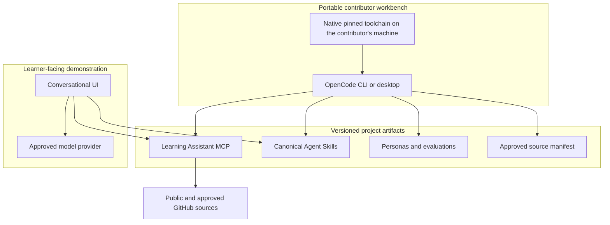

# Implementation Plan

**Prepared:** 2026-07-29  
**Status:** standalone repository initialized; baseline MCP and skills operational

## Architecture decision

This repository is independent from `cmpb_ai_hub`. The AI Hub remains a
personal Claude Desktop and Claude Code replacement. This repository owns the
portable BioHackathon contributor environment and all hackathon artifacts.

The project has two products:

1. A contributor workbench for MCP, skills, retrieval, evaluations, and UI
   development.
2. A polished learner-facing demo that consumes the stable MCP and skill
   contracts.

## Current baseline

- MCP Python SDK v2 with stdio and Streamable HTTP at `/mcp`.
- Two typed tools: `list_resources` and `get_resource`. Nothing else.
- Source configuration validated and separated from the tools.
- Live GitHub listing with an offline Turing Way snapshot as fallback.
- Pinned Python dependencies in `uv.lock`.
- A contributor workbench with lockfile-pinned tools.
- OpenCode 1.18.9 with project MCP configuration and sharing disabled.
- Canonical skills with validation and unit tests.

## Contributor environment

The pinned toolchain in [SETUP.md](SETUP.md) is the required interface because
it installs on managed Windows and macOS hosts without administrator
privileges. OpenCode is the supported AI client because the repository
configuration restricts it to the approved model route; no provider credential
is included in the repository.

Acceptance criteria:

- A new contributor reaches a working prompt or editor in under ten minutes.
- `uv run python scripts/project.py check` passes in a clean environment.
- The environment requires no St. Jude ACR, WARP certificate, local model, or
  owner-specific host path.
- GitHub Copilot and at least one API-key provider are rehearsed before the
  event.
- Organizers provide a contingency for participants with no personal provider.

## MCP development lifecycle

1. Edit normal Python files under `src/learning_assistant`.
2. Run the stdio server through OpenCode or `.vscode/mcp.json`.
3. Use `uv run python scripts/project.py inspect` for MCP Inspector.
4. Run the complete offline check.
5. CI validates code, contracts, and skills on Windows and macOS.
6. A maintainer promotes an approved build to the demo.

Agents may develop, test, and package candidates. They must not silently
replace the trusted demo deployment after reading untrusted source material.

## Source and retrieval work

The server lists resources from GitHub and falls back to the committed snapshot
when the network or the API is unavailable, so a demonstration never dies on a
bad connection. Every result reports which path it took.
`corpus/sources.live.yaml` is the live manifest.

Before the hackathon:

- add mocked GitHub tree and raw-content tests;
- add bounded retry and rate-limit diagnostics;
- record commit SHA and retrieval time in every live document;
- confirm and enable approved St. Jude sources; and
- expand the snapshot to cover the demonstration script.

**There is deliberately no ranking.** Choosing and measuring a retrieval
approach is hackathon work. Lexical scoring, embeddings, vector databases,
hybrid retrieval, and persona-aware reranking are all open, and the first task
in that workstream is agreeing on evaluation cases to measure them against.

## Skill lifecycle

Canonical skills live at `.agents/skills/<name>/SKILL.md`. Each skill must
define triggers, non-goals, MCP dependencies, failure behavior, licensing, and
positive and negative cases. The validator rejects malformed names, missing
sections, unknown tools, and common credential patterns.

The canonical directory is directly discoverable by OpenCode, so there are no
client-specific copies to maintain by hand.

## Demo requirements

The final UI must show:

- persona selection;
- suggested starter questions;
- source citations and update metadata;
- an ordered learning path;
- a visible distinction between public and institutional sources; and
- at least one skill-driven workflow.

LibreChat remains a valid fallback, but no configuration from the personal AI
Hub is required. A custom UI can replace it after passing the same demonstration
script and MCP contract.

## Work order

### P0 before participants arrive

1. Confirm the shared GitHub remote and contributor access.
2. Rehearse native onboarding on a managed contributor workstation.
3. Guarantee at least one model-provider route.
4. Finish live GitHub tests, metadata, and failure handling.
5. Approve and enable the initial St. Jude source set.
6. Build the fallback learner-facing demo.
7. Add the two reference skills to the demonstration script.
8. Record a short offline fallback demo.

### P1 strongly preferred

1. Add executable retrieval and skill evaluation cases.
2. Add dependency vulnerability scanning.
3. Add source-quality and accessibility review rubrics.

### Hackathon workstreams

- Source curation and licensing
- Personas, user journeys, and evaluations
- MCP tools and adapters
- Retrieval experiments
- Domain-specific skills
- Learner-facing interface
- Reproducibility, CI, provenance, and release packaging

## Non-goals

- Reproducing the personal AI Hub deployment
- Giving the learner UI unrestricted host command access
- Requiring a local GPU, administrator privileges, or one paid provider
- Handling PHI during the event
- Building vector infrastructure before baseline evaluation exists
- Automatically deploying unreviewed agent-generated code

## Open decisions

1. What GitHub organization/repository will host the remote?
2. Which model route is guaranteed for attendees without keys?
3. Which institutional resources are approved for the event?
4. Will the guaranteed fallback UI be LibreChat or a purpose-built app?
5. Who owns deployment promotion during the event?
